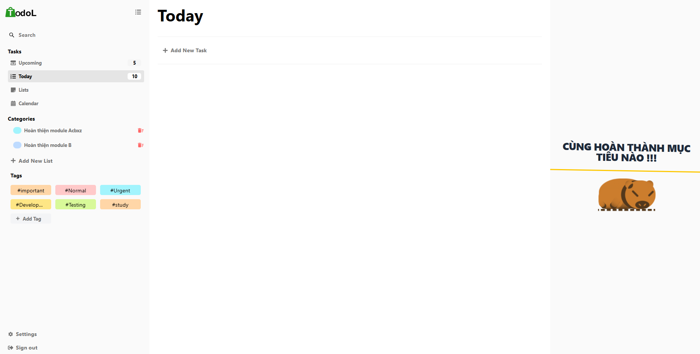

# TodoL - Task Management Application

_A modern and efficient task management application built with MERN stack_



## Tech Stack

### Backend

- **Runtime:** Node.js
- **Database:** MongoDB
- **API:** RESTful API

### Frontend

- **Framework:** React.js
- **UI Library:** Ant Design
- **Styling:** Tailwind CSS
- **State Management:** Zustand
- **HTTP Client:** Axios

## Prerequisites

Before you begin, ensure you have the following installed:

- Node.js (v14 or higher)
- MongoDB (v4.4 or higher)
- npm or yarn

## Installation

### 1. Clone the repository

```bash
git clone https://github.com/nghiahd147/TodoL.git
cd todoL
```

### 2. Backend Setup

```bash
# Navigate to backend directory
cd todo

# Install dependencies
yarn

# Create .env file
PORT, MONGO_URI

# Start the server
yarn start
```

### 3. Frontend Setup

```bash
# Navigate to frontend directory
cd web-admin

# Install dependencies
yarn

# Start the development server
yarn start
```

## Environment Variables

### Backend (.env)

```env
PORT=5000
MONGODB_URI=mongodb://localhost:27017/todol
NODE_ENV=development
```

### Frontend (.env)

```env
VITE_API_URL=http://localhost:5000/api
```

## Running the Application

### Development Mode

```bash
# Backend
cd todo
yarn start

# Frontend
cd web-admin
yarn start
```

## Contributing

Contributions are welcome! Please feel free to submit a Pull Request.

## License

This project is licensed under the MIT License.

## Accumulation

### Note

- form.setFieldsValue: set giá trị trong Form
- form.resetFields: reset giá trị trong Form
- Nếu 1 error ghi là mong đợi 1 dấu ; trong 1 object thì có thể bạn đang thiếu 1 dấu ngoặc tròn bao bọc ()
- Combo sunsil óng mượt `transition-all duration-300 ease-in-out`
- onMouseEnter: xác định chuột đang hover vào
- onMouseLeave: xác định chuột bỏ hover
- Combo ẩn chữ ...: `overflow-hidden whitespace-nowrap text-ellipsis`
- color.toHexString(): dùng để lấy ra mã màu `#000` ở ColorPicker
- italic: chữ nghiêng trong tailwindcss
- {{ transform: "scale(1.4)" }} dùng để tằng kích thước cho component Checkbox của Ant Design
- onContextMenu(): sự kiện chuột phải | e.preventDefault() loại bỏ chuột phải mặc định (dùng khi cần chuột phải vào đâu ra giao diện của mình)
- {...bien, current: false}: show gtri cũ, và chỉ thay đổi gia trị đang set lại

#### React-Router-Dom

```jsx
<Routes>
  <Route element={page}>
    <Route path="/" element={name_page}>
    <Route path="/list" element={name_page}>
  </Route>
</Routes>
```
